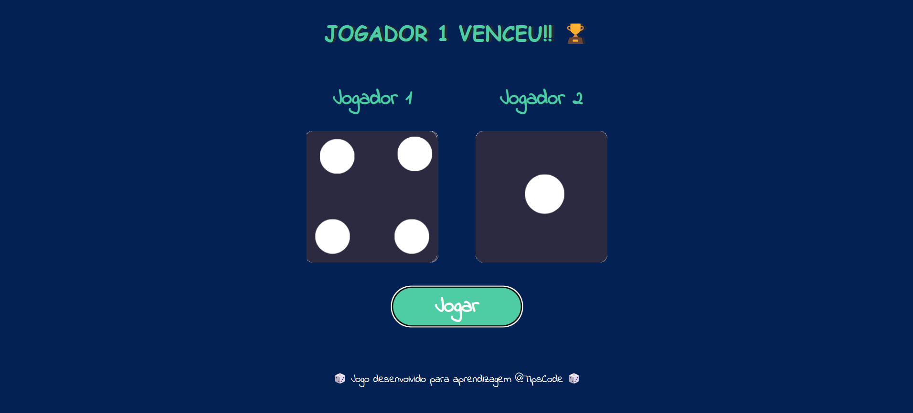

# 🎲 Rolou o DADO

Um mini jogo de dados feito com **HTML**, **CSS** e **JavaScript**, ideal para quem está começando na programação web. Ao clicar em **"Jogar"**, dois dados são rolados e um vencedor é mostrado — ou empate, se os valores forem iguais.

---

## 📸 Preview

<!-- Substitua pela imagem real ou um gif do funcionamento -->

---

## 🚀 Tecnologias Utilizadas

- HTML5  
- CSS3  
- JavaScript (Vanilla)  
- Google Fonts (Indie Flower)

---

## 🧩 Como Funciona

- Cada vez que o botão **Jogar** é clicado:
  - Dois números aleatórios entre 1 e 6 são gerados.
  - As imagens dos dados são atualizadas de acordo com os números.
  - Uma mensagem exibe o vencedor ou se houve empate.

